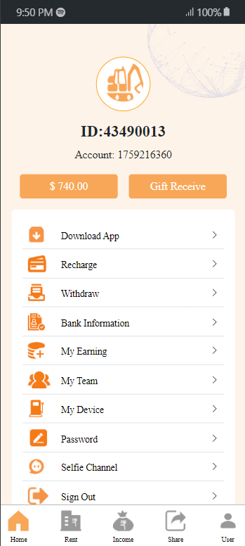

# Design 

Here is a complate flow chart:

```mermaid
graph TD;
    Register-->Login;
    Login-->Home;
    Home-->My;
    Home-->Recharge;
    Recharge-->Recharge History;
    Home-->Withdraw;
    Withdraw-->Withdraw History;
    Home-->Team;
    Team-->Team Detail;
    Home-->VIP;
    VIP-->VIP Detail;
    My-->History;
    My-->Recharge History;
    My-->Withdraw History;
    My-->Bank Setting;
    My-->Password Change;
    My-->Logout;
```

### Login


### Register


### Account



### Vip


### Vip Detail


### Transaction


### Withdraw


### Home


### Deposit


### Recharge History


### My Bank


### Team


### Team Detail


### Password Change

