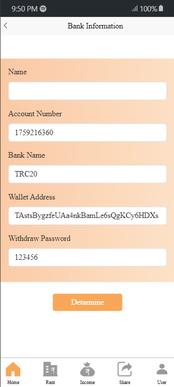

# Design 

Here is a complate flow chart:

### Login

### Register

### Account

### Vip

### Vip Detail

### Transaction

### Withdraw

### Home

### Deposit

### Recharge History

### My Bank

### Team

### Team Detail

### Password Change

